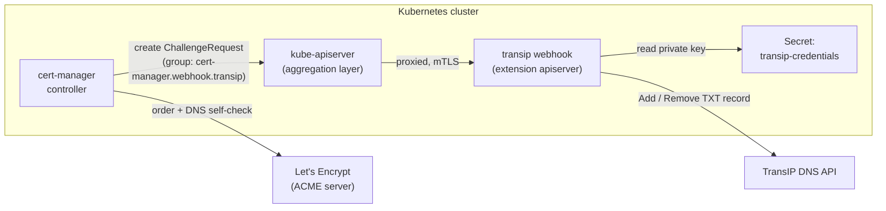
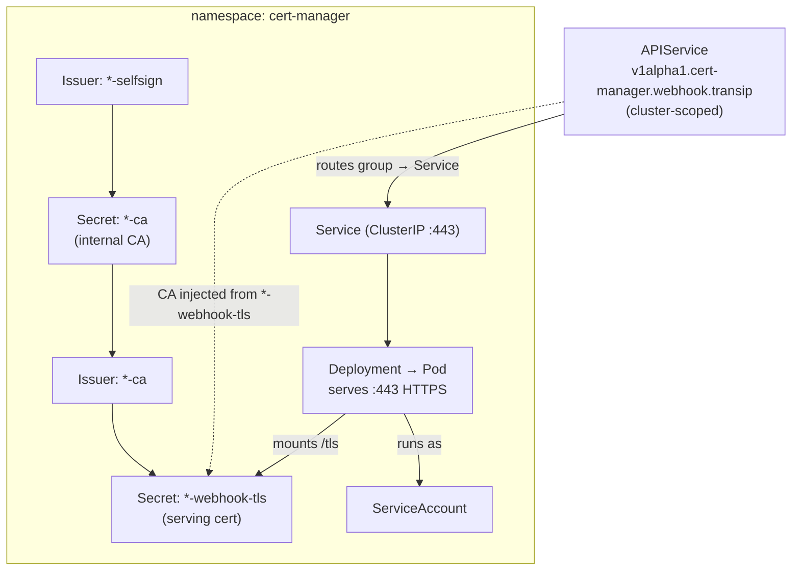
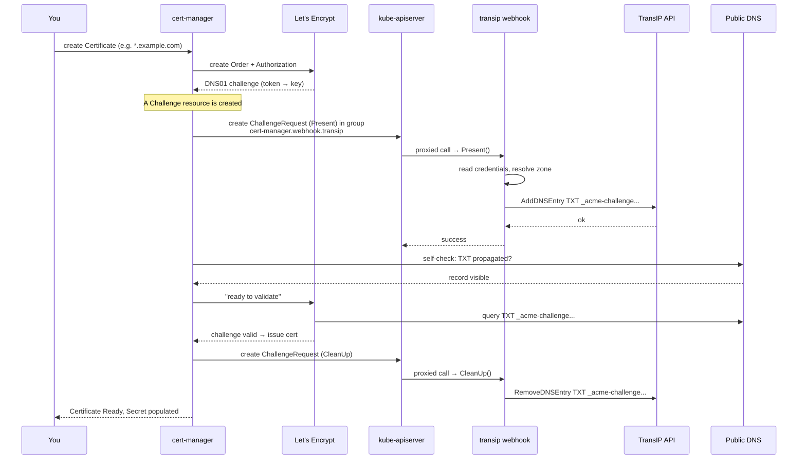
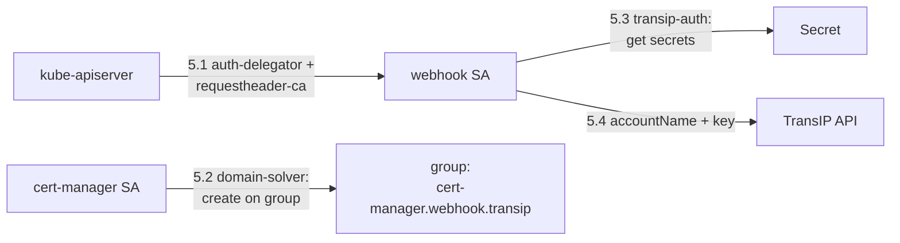

# Architecture — cert-manager-webhook-transip

**Audience:** Cluster operators and users who install, configure, and run this
webhook. Assumes working knowledge of Kubernetes (Deployments, Services, RBAC,
Secrets) and a basic understanding of cert-manager and ACME. You do **not** need
to read Go to use this document.

**What this component is:** a [cert-manager](https://cert-manager.io/) DNS01
solver webhook that completes ACME DNS01 challenges by creating and deleting
`TXT` records in [TransIP](https://www.transip.nl/) DNS, using the TransIP REST
API. It lets cert-manager issue certificates (including wildcards) for domains
whose DNS is hosted at TransIP.

| Item | Value |
|------|-------|
| Language / runtime | Go (static binary on Alpine) |
| cert-manager version built against | `v1.20.2` |
| TransIP client (`gotransip`) | `v6.27.1` |
| Chart / app version | `1.20.4` |
| API group (`groupName`) | `cert-manager.webhook.transip` |
| Solver name | `transip` |
| Default namespace | `cert-manager` |
| Service type / port | `ClusterIP` / `443` (HTTPS) |

---

## 1. The big picture

cert-manager cannot talk to every DNS provider directly. For providers it does
not support natively, it defines a **webhook contract**: an external service that
cert-manager calls to *present* (create) and *clean up* (delete) the
`_acme-challenge` `TXT` record required by an ACME DNS01 challenge.

This project implements that contract for TransIP. It is not an ordinary HTTP
service — it registers itself as an **extension API server** in the Kubernetes
[aggregation layer](https://kubernetes.io/docs/tasks/extend-kubernetes/configure-aggregation-layer/).
cert-manager "calls" the webhook by creating a `ChallengeRequest` object against
the aggregated API group `cert-manager.webhook.transip`; the Kubernetes API
server proxies that call to this webhook's pod, which then talks to the TransIP
API.

**Key idea:** cert-manager owns the ACME conversation and decides *when* a `TXT`
record must exist. The webhook is a thin, stateless executor that only knows how
to *create* and *delete* one `TXT` record in TransIP on request.

---

## 2. Deployed components

Installing the Helm chart (or `deploy/recommended.yaml`) creates the following in
the `cert-manager` namespace unless noted otherwise.

| Kind | Name (pattern) | Purpose |
|------|----------------|---------|
| `Deployment` | `<release>-cert-manager-webhook-transip` | Runs the webhook pod; serves HTTPS on `:443`. |
| `Service` | `<release>-cert-manager-webhook-transip` | `ClusterIP` fronting the pod on port `443`. |
| `APIService` | `v1alpha1.cert-manager.webhook.transip` | Registers the webhook into the aggregation layer so the group becomes a callable API. |
| `ServiceAccount` | `<release>-cert-manager-webhook-transip` | Identity the webhook pod runs as. |
| RBAC (Roles / Bindings) | several (see §5) | Wires up aggregation-layer auth, lets cert-manager call the solver, lets the webhook read the credentials Secret. |
| PKI (`Issuer` + `Certificate` ×) | `*-selfsign`, `*-ca`, `*-webhook-tls` | Self-managed certificate chain for the webhook's serving TLS (see §4). |

These are **not** the certificates you are trying to issue for your apps. They
are internal plumbing so the API server trusts the webhook.

---

## 3. End-to-end request flow

This is what happens when you create a `Certificate` for a TransIP-hosted domain.

Two responsibilities are worth separating clearly:

- **cert-manager** does the ACME ordering, decides the challenge `key`, runs the
  **DNS propagation self-check**, and tells ACME when to validate. If issuance
  hangs in "propagating", that is cert-manager waiting on public DNS — not
  necessarily a webhook failure.
- **The webhook** only ever does two things: add the right `TXT` record
  (`Present`) and remove it afterwards (`CleanUp`).

---

## 4. Serving TLS and the aggregation layer

Because the webhook is an extension API server, the Kubernetes API server will
only route to it over TLS that it trusts. The chart bootstraps this chain using
cert-manager itself:

1. **`*-selfsign`** — a self-signed `Issuer`.
2. **`*-ca`** — a CA `Certificate` (valid 5 years) signed by the self-signed
   issuer. Its key/cert land in the `*-ca` Secret.
3. **`*-ca`** `Issuer` — a CA issuer backed by that Secret.
4. **`*-webhook-tls`** — the webhook's serving `Certificate` (valid 1 year),
   signed by the CA issuer, with DNS SANs for the in-cluster Service name.

The serving Secret `*-webhook-tls` is mounted into the pod at `/tls`, and the
container starts with `--tls-cert-file=/tls/tls.crt --tls-private-key-file=/tls/tls.key`.

The `APIService` carries the annotation
`cert-manager.io/inject-ca-from: <namespace>/<serving-cert>`. cert-manager's
**CA injector** copies the CA bundle into the `APIService.spec.caBundle`, so the
kube-apiserver trusts the webhook's serving certificate. This creates a
**bootstrap dependency: cert-manager must be running and healthy before the
webhook's own certs can be issued.**

> Operator note: cert-manager renews the serving certificate automatically well
> before its 1-year expiry (at roughly two-thirds of its lifetime). No manual
> rotation is required, but if cert-manager is broken for an extended period,
> both this chain and your real certificates stall.

---

## 5. Identity, authentication, and authorization

There are **four distinct trust relationships** in play. Mixing them up is the
most common source of confusion when debugging.

### 5.1 kube-apiserver ↔ webhook (aggregation layer auth)

So the API server can authenticate itself to the webhook and delegate auth
decisions, the chart grants the webhook's ServiceAccount:

- `RoleBinding` to `extension-apiserver-authentication-reader` in `kube-system`
  — lets the webhook read the API server's `requestheader-ca` ConfigMap.
- `ClusterRoleBinding` to `system:auth-delegator` — lets the webhook delegate
  `TokenReview`/`SubjectAccessReview` back to the core API server.

### 5.2 cert-manager → webhook (authorization to call the solver)

The webhook exposes the resource group `cert-manager.webhook.transip`.
cert-manager must be allowed to `create` against it:

- `ClusterRole` `*-domain-solver` grants `create` on `*` in the group.
- `ClusterRoleBinding` binds it to the **cert-manager** ServiceAccount
  (`certManager.serviceAccountName` in `certManager.namespace`).

If this binding targets the wrong cert-manager ServiceAccount or namespace,
challenges fail with authorization errors before the webhook ever runs.

### 5.3 webhook → Kubernetes Secret (reading TransIP credentials)

The webhook reads the TransIP private key from a Secret using its own
ServiceAccount:

- `Role` `*-transip-auth` grants `get` on `secrets` in `certManager.namespace`,
  bound to the **webhook's** ServiceAccount.

> Important: the webhook reads the Secret from the **challenge's resource
> namespace** (`ResourceNamespace`). For a `ClusterIssuer`, that is the
> cert-manager controller's **cluster resource namespace**
> (`--cluster-resource-namespace`), which the standard cert-manager Helm install
> sets to the cert-manager namespace — where this Role grants access. (The bare
> controller default is `kube-system`, so a non-standard install may differ.)
> For a **namespaced `Issuer` in another namespace**, the webhook would need
> `get secrets` permission in *that* namespace too — which this chart does not
> grant by default. Plan credential placement accordingly.

### 5.4 webhook → TransIP API (provider authentication)

The webhook authenticates to TransIP with:

- `accountName` — your TransIP username (from the solver `config`).
- a **private key** — either inline (`privateKey` in config, discouraged) or, in
  practice, read from the referenced Secret (`privateKeySecretRef`). The key is
  passed to the `gotransip` client, which signs API requests.

There is also a `*-flowcontrol-solver` ClusterRole/Binding granting `list`/`watch`
on API Priority and Fairness resources, which extension API servers need to
participate in the cluster's flow-control.

---

## 6. Inside `Present` and `CleanUp`

Both methods are deliberately **idempotent and stateless** — they hold no local
state and tolerate repeated calls (cert-manager may retry).

**Shared steps (both methods):**

1. `loadConfig` — decode the solver `config` JSON into `accountName`, `ttl`,
   `privateKey`/`privateKeySecretRef`.
2. Build a TransIP client — use the inline key if present, otherwise fetch the
   key from the referenced Secret in the challenge's resource namespace.
3. Resolve the **authoritative zone**: `extractDomainName` walks DNS from the
   challenge zone using recursive nameservers to find the SOA (apex) domain; it
   falls back to the supplied zone if lookup fails.
4. Compute the **relative record name** with `extractRecordName` (strips the
   apex domain off the FQDN, e.g. `_acme-challenge.www`).
5. Fetch existing DNS entries for the domain (`GetDNSEntries`).

**`Present`:** if a matching `TXT` entry already exists (compared on **name +
type + content**, ignoring TTL), it returns successfully without change.
Otherwise it adds a `TXT` entry with `Content = challenge key` and
`Expire = ttl`.

**`CleanUp`:** finds the entry matching **name + type + content** and removes
exactly that one. Matching on content (the challenge key) means concurrent
validations for the same domain do not delete each other's records. If no match
is found, it is a no-op.

> The `ttl` from config maps to the record's `Expire`. If unset it defaults to
> `0`; setting an explicit value (e.g. `300`) is recommended so propagation and
> cleanup behave predictably.

---

## 7. Configuration surface (operator reference)

Provided per-issuer in the ACME solver `webhook.config` block:

| Key | Type | Required | Notes |
|-----|------|----------|-------|
| `accountName` | string | yes | TransIP username. |
| `privateKeySecretRef` | SecretKeySelector | yes (recommended) | `{ name, key }` of the Secret holding the TransIP API private key. |
| `privateKey` | bytes | no | Inline key. Avoid — prefer the Secret reference. |
| `ttl` | int | no | TXT record TTL (`Expire`). Set explicitly, e.g. `300`. |

Chart values that shape the deployment: `groupName`, `certManager.namespace`,
`certManager.serviceAccountName`, `image.*`, `service.*`, `resources`,
`nodeSelector`, `tolerations`, `affinity`, and (for private registries)
`image.privateRegistrySecretName`.

See the [README](../README.md) for the concrete `ClusterIssuer` and `Certificate`
examples.

---

## 8. Security and operational boundaries

- **No inbound exposure.** The Service is `ClusterIP`; only the kube-apiserver
  (via the aggregation layer) reaches the webhook. Do not expose it externally.
- **Stateless.** The pod keeps no persistent data; it can be rescheduled freely.
  A single replica is sufficient for correctness (challenges are retried), though
  you may scale for availability.
- **Credential blast radius.** The TransIP private key grants DNS control over
  your TransIP domains. Keep it in a Kubernetes Secret (ideally sourced from a
  secret manager / ExternalSecret), restrict who can read the `cert-manager`
  namespace, and prefer `privateKeySecretRef` over an inline key.
- **Egress.** The pod needs outbound HTTPS to the TransIP API and the cluster
  must be able to resolve public DNS for cert-manager's self-check.
- **Failure isolation.** A webhook outage blocks new DNS01 issuance/renewal for
  TransIP domains but does not affect already-issued certificates until they near
  expiry.

---

## 9. Common failure modes (quick map)

| Symptom | Likely layer | Where to look |
|---------|--------------|---------------|
| Challenge `pending`, never reaches the webhook | §5.2 authorization | cert-manager logs; `*-domain-solver` binding targets correct SA/namespace |
| `no private key for <key> in secret ...` | §5.3 / §5.4 | Secret name/key, namespace (ClusterIssuer → `cert-manager` ns), `*-transip-auth` Role |
| TLS / `x509` errors calling the webhook | §4 serving TLS | `*-webhook-tls` Secret present; CA injected into the `APIService` `caBundle`; cert-manager + ca-injector healthy |
| Stuck "propagating" / self-check | cert-manager DNS self-check (not the webhook) | Public DNS resolution from the cluster; record actually created at TransIP |
| TransIP API auth/zone errors | §5.4 / §6 | `accountName`, key validity, domain actually hosted at TransIP |

For deeper diagnostics, raise webhook log verbosity (klog `-v=4`) to see the
per-step `InfoS` traces in `Present`/`CleanUp`.

---

## 10. Build and packaging (context)

The container is a multi-stage build (`golang:1.25-alpine` → static binary →
`alpine:3.23` with `ca-certificates`), entrypoint `webhook`. The binary requires
the `GROUP_NAME` environment variable (set by the chart from `groupName`) and the
two `--tls-*` flags (set by the chart from the mounted serving cert). Release
versioning is driven by `make` targets and tracked in `.release` / `Chart.yaml`.
